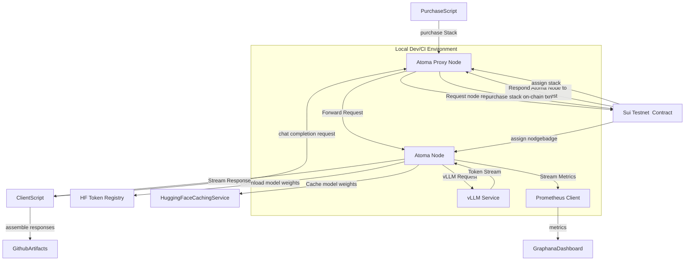

# End to end test dev environment for the Atoma Network

This repository contains an end to end test dev environment for the Atoma Network. This can be be run locally or in a CI environment.

Ideally in the future this can be used to run performance benchmarks for the Atoma Network across various network conditions.

## Infrastructure Setup

The infrastructure setup is currently managed through a series of scripts in the `scripts` folder, with plans to migrate to Terraform in the future. The setup process consists of:

1. **Node Setup** (`node_setup`): Configures a node with NVIDIA runtime and CUDA environment, specifically optimized for Tensor T4 GPU.
2. **Proxy Setup** (`proxy_setup`): Initializes a proxy node with a database to connect to the main node.
3. **Environment Configuration**: The `API_URL` is returned as an environment variable, which is then used by the e2e test script.

All components are containerized using Docker and deployed on cloud infrastructure.

### Important Prerequisites

- **USDC Wallet Balance**: The node's Sui wallet must have sufficient USDC balance to purchase stacks. This is a critical requirement for the infrastructure setup to succeed.

## Testing Components

- **End-to-End Tests**: Located in the root directory, these tests verify the complete functionality of the system.
- **Stress Tests**: Located in the `runner` folder, these tests evaluate system performance under concurrent load.
- **Future Testing Integration**: Plans to integrate [k6](https://k6.io/) for comprehensive end-to-end testing, enabling:
  - Load testing
  - Performance benchmarking
  - Scalability testing
  - Custom test scenarios

## CI/CD Integration

The repository includes a reusable GitHub Action that:

- Accepts an infrastructure secret key (currently supporting AWS)
- Spins up the required infrastructure
- Performs an end-to-end chat completion test
- Outputs the results as a GitHub artifact

### Configurable Parameters

The GitHub Action supports dynamic configuration of various node parameters:

- Model selection and configuration
- vLLM command parameters
- Maximum model length
- Other runtime configurations

These parameters can be customized through action inputs, allowing for flexible testing scenarios and performance tuning.

## Architecture

## License

Dual-licensed: [MIT](./LICENSE-MIT), [Apache Software License v2](./LICENSE-APACHE), by way of the
[Permissive License Stack](https://protocol.ai/blog/announcing-the-permissive-license-stack/).
